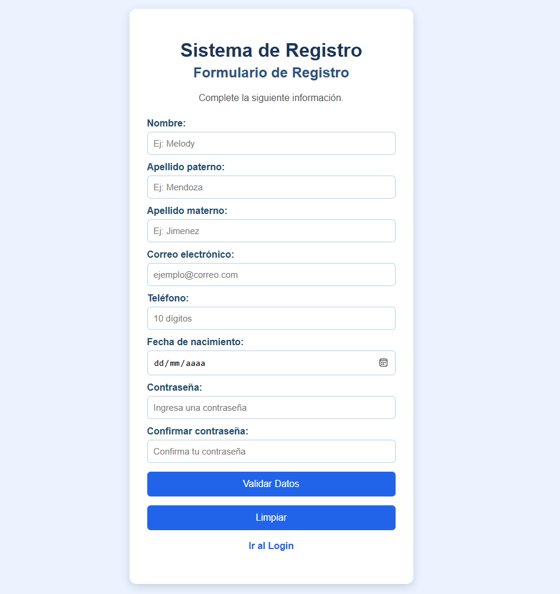
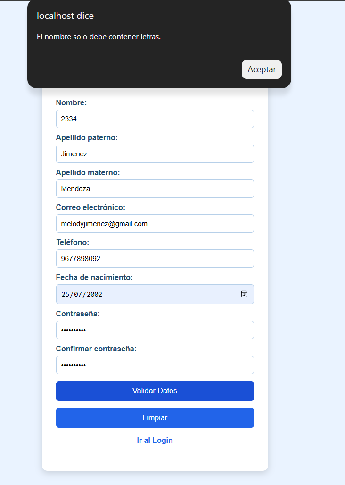
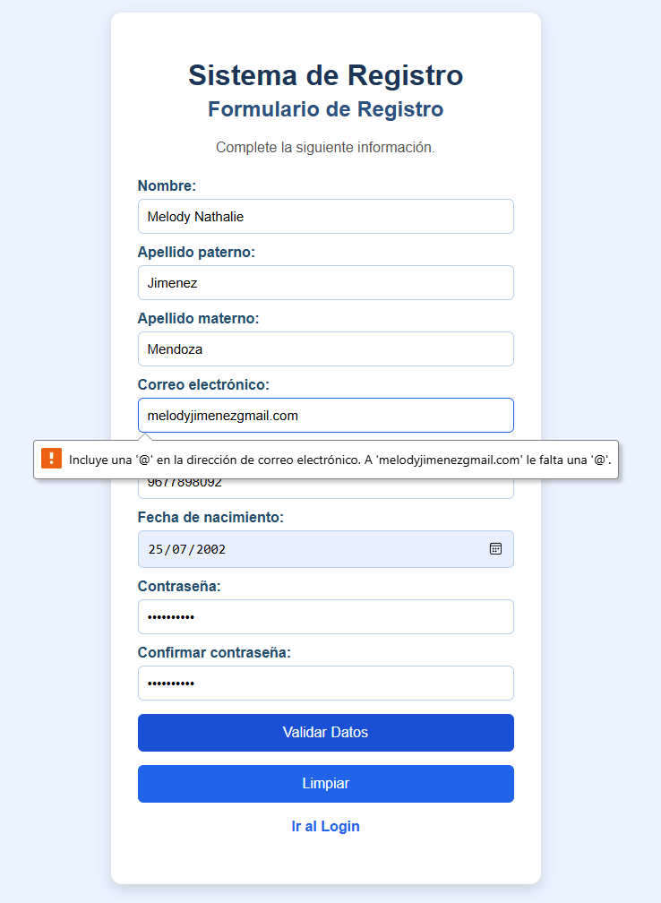
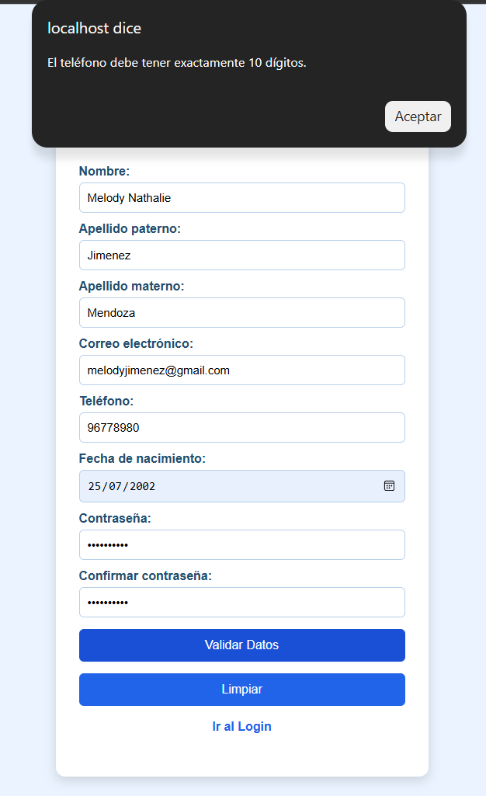
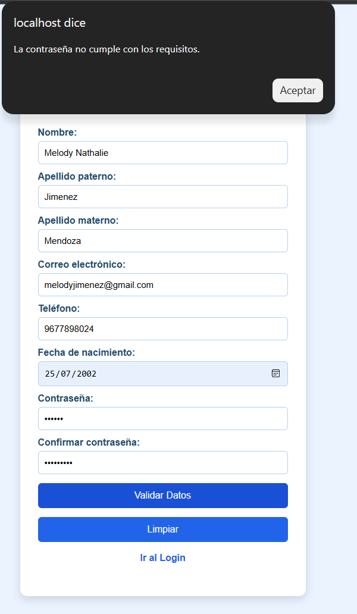
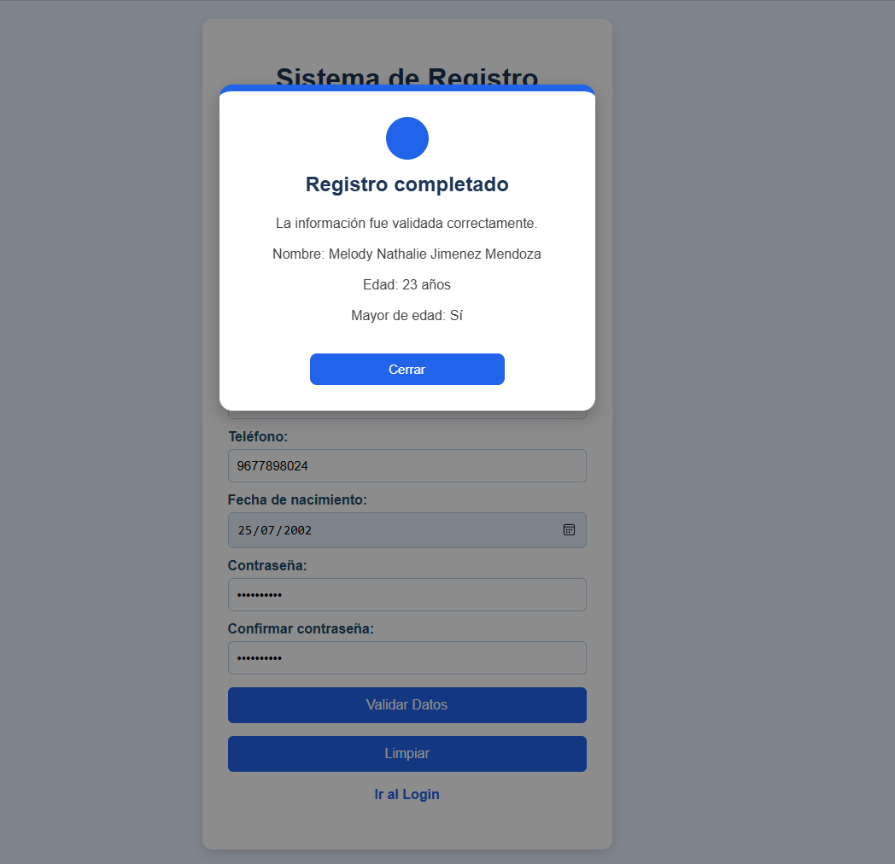
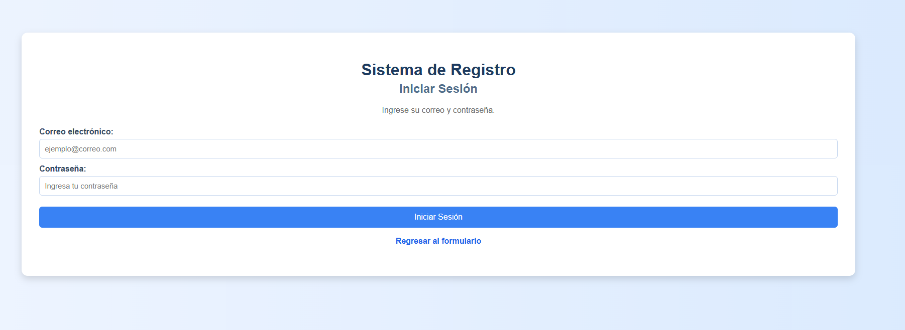
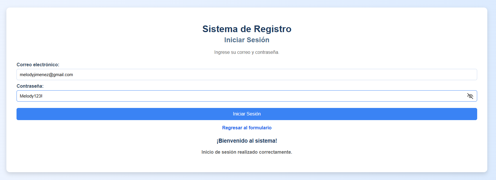
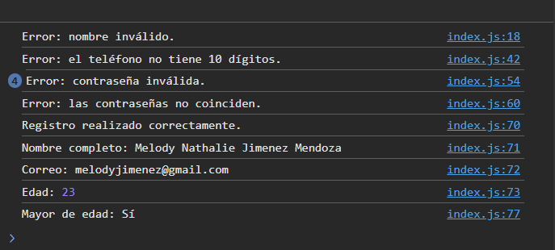

# Actividad 2. Librería utileria.js

## Programación Web
### Verano 2026

**INSTITUTO TECNOLÓGICO DE OAXACA**
---

**Docente:** Mtra. Adelina Martinez Nieto

**Alumno:** Mendoza Jimenez Melody Nathalie23161034

**Grupo:** 7SC

**Carrera:** Ingeniería en Sistemas Computacionales

**Actividad:** Actividad 2. Librería **utileria.js**

---
# Objetivo

Desarrollar una librería en JavaScript que permita reutilizar funciones de validación dentro de un formulario de registro y un inicio de sesión, aplicando buenas prácticas de organización del código y facilitando su uso en diferentes páginas del proyecto.

---

# Descripción

En esta actividad se desarrolló una librería en JavaScript llamada **utileria.js**, la cual fue integrada en un formulario de registro y una página de inicio de sesión.

El objetivo del proyecto fue aplicar funciones reutilizables para validar la información ingresada por el usuario, evitando datos incorrectos antes de completar un registro o permitir el acceso al sistema.

Además del uso de la librería, se implementó una ventana modal para mostrar los resultados del registro, un diseño responsive para distintos dispositivos y una estructura organizada del proyecto utilizando HTML, CSS y JavaScript.

---

# Problema que resuelve

Cuando un usuario llena un formulario puede cometer errores como:

- Escribir un correo electrónico incorrecto.
- Escribir números donde únicamente deben existir letras.
- Utilizar contraseñas inseguras.
- Escribir dos contraseñas diferentes.
- Ingresar un teléfono con una longitud incorrecta.
- No conocer automáticamente si es mayor de edad.

La librería **utileria.js** permite validar estos datos antes de procesarlos, evitando errores y mejorando la calidad de la información capturada.

---

# Tecnologías utilizadas

- HTML5
- CSS3
- JavaScript
- GitHub
- GitHub Pages

---

# Instalación

Para utilizar la librería es necesario descargar o clonar el repositorio y conservar la estructura de carpetas del proyecto.

Posteriormente, se debe agregar el archivo **utileria.js** dentro del documento HTML antes del archivo JavaScript donde será utilizada.

```html
<script src="js/utileria.js"></script>
```

Una vez importada la librería, cualquiera de sus funciones puede utilizarse desde otros archivos JavaScript del proyecto.

Por ejemplo:

```javascript
if(validarCorreo(correo)){
    console.log("Correo válido");
}
```

En este proyecto la librería fue utilizada tanto en el formulario de registro (**index.html**) como en el inicio de sesión (**login.html**).

---

# Estructura del proyecto

```
utileria/
│
├── README.md
├── index.html
├── login.html
│
├── css/
│   ├── index.css
│   └── login.css
│
├── js/
│   ├── utileria.js
│   ├── index.js
│   └── login.js
│
└── img/
```

---

# Funciones obligatorias

## 1. validarCorreo(correo)

Valida que el correo electrónico tenga un formato correcto.

### Ejemplo

```javascript
var correo = "ejemplo@gmail.com";

if(validarCorreo(correo)){
    console.log("Correo válido");
}
```

---

## 2. soloLetras(texto)

Permite verificar que un texto contenga únicamente letras, incluyendo vocales acentuadas y la letra ñ.

### Ejemplo

```javascript
var nombre = "Melody";

if(soloLetras(nombre)){
    console.log("Nombre válido");
}
```

---

## 3. validarLongitud(numero,maxLongitud)

Verifica que un número no sobrepase la longitud indicada.

### Ejemplo

```javascript
if(validarLongitud("9511234567",10)){
    console.log("Longitud correcta");
}
```

---

## 4. calcularEdad(fechaNacimiento)

Calcula automáticamente la edad del usuario.

### Ejemplo

```javascript
var edad = calcularEdad("2003-05-15");

console.log(edad);
```

---

## 5. esMayorDeEdad(fechaNacimiento)

Determina si una persona es mayor de edad.

### Ejemplo

```javascript
if(esMayorDeEdad("2003-05-15")){
    console.log("Es mayor de edad");
}
```

---

## 6. validarPassword(password)

Comprueba que la contraseña cumpla con los siguientes requisitos:

- Mínimo 8 caracteres.
- Una letra mayúscula.
- Una letra minúscula.
- Un número.
- Un carácter especial.

### Ejemplo

```javascript
var contraseña="Melody123!";

if(validarPassword(contraseña)){
    console.log("Contraseña válida");
}
```

---

# Funciones adicionales

Además de las funciones solicitadas, se implementaron dos funciones propias.

---

## compararPassword(contra,confirmarPassword)

Esta función compara la contraseña escrita por el usuario con la confirmación de contraseña para asegurarse de que ambas sean iguales.

Fue utilizada dentro del formulario de registro antes de completar el proceso.

### Ejemplo

```javascript
if(compararPassword("Melody123!","Melody123!")){
    console.log("Las contraseñas coinciden");
}
```

---

## generarNombreCompleto(nombre,apellidoPaterno,apellidoMaterno)

Esta función une el nombre y los dos apellidos para formar el nombre completo del usuario.

Fue utilizada para mostrar el resultado dentro de la ventana modal al finalizar el registro.

### Ejemplo

```javascript
var nombreCompleto = generarNombreCompleto(
    "Melody",
    "Mendoza",
    "Jimenez"
);

console.log(nombreCompleto);
```

---

# Integración de la librería

## Formulario de registro

Dentro del formulario principal se utilizan las funciones para:

- Validar nombres.
- Validar correo.
- Validar longitud del teléfono.
- Validar contraseña.
- Comparar contraseñas.
- Calcular edad.
- Determinar si el usuario es mayor de edad.
- Generar el nombre completo.
- Mostrar la información mediante una ventana modal.

---

## Inicio de sesión

En la página de inicio de sesión se reutilizan las funciones:

- validarCorreo()
- validarPassword()

Si ambas validaciones son correctas se muestra un mensaje de bienvenida al usuario.

---

# Capturas de pantalla

## Formulario de registro

Vista principal del formulario donde el usuario ingresa toda su información antes de realizar el registro.

<p align="center">
  
</p>

---

## Validación del nombre

Ejemplo de la validación cuando el nombre contiene caracteres no permitidos.

<p align="center">
  
</p>

---

## Validación del correo electrónico

Ejemplo de la validación cuando el correo electrónico no tiene un formato correcto.

<p align="center">
  
</p>

---

## Validación del teléfono

Ejemplo cuando el número telefónico no cumple con la longitud requerida.

<p align="center">
  
</p>

---

## Validación de la contraseña

Ejemplo cuando la contraseña no cumple con las reglas establecidas por la librería.

<p align="center">
  
</p>

---

## Ventana modal

Resultado mostrado después de completar correctamente el formulario de registro.

<p align="center">
  
</p>

---

## Inicio de sesión

Pantalla donde el usuario ingresa su correo electrónico y contraseña.

<p align="center">
  
</p>

---

## Inicio de sesión correcto

Mensaje mostrado cuando el usuario inicia sesión correctamente después de validar sus datos.

<p align="center">
  
</p>

---

## Consola del navegador

Durante las pruebas del proyecto se utilizaron instrucciones `console.log()` para verificar que las funciones de la librería recibieran correctamente la información y produjeran los resultados esperados.

Ejemplo utilizado durante las pruebas:

```javascript
console.log("Registro realizado correctamente.");
console.log("Nombre completo:", nombreCompleto);
console.log("Correo:", correo);
console.log("Edad:", edad);

if(mayor){
    console.log("Mayor de edad: Sí");
}
else{
    console.log("Mayor de edad: No");
}
```

Captura de la consola:

<p align="center">
  
</p>
---


# Video demostrativo

El funcionamiento completo del proyecto puede visualizarse en el siguiente video:

https://youtu.be/AD0ASH3gv8Y?si=W9d8LzMlmcgmmWom

----

# Conclusión

El desarrollo de esta actividad permitió poner en práctica los conocimientos adquiridos durante el curso sobre HTML, CSS y JavaScript mediante la creación de una librería reutilizable para validar información.

Durante el proyecto se trabajó con funciones, validaciones, expresiones regulares, manipulación del DOM, ventanas modales y diseño responsive, integrando todos estos elementos en un formulario de registro y un inicio de sesión.

Una de las principales ventajas de utilizar una librería es que las funciones pueden reutilizarse en diferentes páginas sin necesidad de escribir nuevamente el mismo código, facilitando la organización del proyecto y haciendo que su mantenimiento sea más sencillo.

Esta actividad permitió comprender la importancia de separar la lógica de validación del resto del programa y desarrollar una solución más ordenada, reutilizable y fácil de implementar en futuros proyectos.
